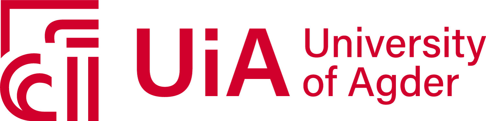

# DataDrivenPumpSchedulingDL:
<p align=justify>
This is a binary classification problem addressed by the feed forward neural networks and driven by deep learning. In this work, the objective is to design a data-driven controller, which could estimate the pump scheduling of a given water distribution network in real-time. The data-driven controller is designed from a feed-forward deep neural network,  and the necessary dataset is obtained from the state-of-the-art mixed-integer solver. One may question the necessity to design a data-driven controller even though there exists mixed-integer solvers (such as Gurobi). The primary reason is that computing an optimal pump scheduling of a large-scale water distribution network is an NP-Hard problem. Solving such problems using traditional optimization solvers is a computationally inefficient approach. Therefore, we presented a data-driven controller using deep learning, which can potentially estimate the time-ahead pump scheduling given the estimated nodal water demand. This controler is tested for various time horizons such as T = 10 hrs, T=15 Hrs, T= 20 Hrs, and T=24 Hrs). The results demonstrates that this controller can potentially estimate the time ahead pump scheduling with error < 0.001. Kindly **refer** [[1]](#1).      

# Requirements:
- [`TensorFlow`](https://www.tensorflow.org/)
- [`Keras`](https://keras.io/)
- [`numpy`](https://numpy.org/devdocs/)
- [`Gurobi`](https://www.gurobi.com/)
- [`matplotlib`](https://matplotlib.org/)
- [`pandas`](https://pandas.pydata.org/)
- [`jupyter`](https://jupyter.org/)

## Installation
This framework is suitable for Python >= 3.7 environment. In addition, to generate relevant dataset, kindly use functionalities of Gurobi Solver (https://www.gurobi.com/resource/modeling-examples-using-the-gurobi-python-api-in-jupyter-notebook/)


## License
The project is licensed under the [GNU General Public License v3.0](https://www.gnu.org/licenses/gpl-3.0.en.html).


## BibTeX Citation

If you refer this data-driven controller/approach in a scientific publication, we would appreciate using the following citations:

```
@inproceedings{bhardwaj2021data,
  title={Data-Driven Pump Scheduling for Cost Minimization in Water Networks},
  author={Bhardwaj, Jyotirmoy and Krishnan, Joshin and Beferull-Lozano, Baltasar},
  booktitle={2021 IEEE International Conference on Autonomous Systems (ICAS)},
  pages={1--5},
  year={2021},
  organization={IEEE}
}
```


## Citing Work

* **Dimitris Bertsimas and Bartolomeo Stellato**. *Online Mixed-Integer Optimization in Milliseconds*. arXiv (2021). https://arxiv.org/pdf/1907.02206.pdf.


## Funding
This project is/was partially funded through:

[](https://atlantardc.wordpress.com) Atlanta Research Data Center: [A Polygon-Based Approach to Spatial Network Allocation](https://atlantardc.files.wordpress.com/2018/05/ardc-newsletter_2018_2.pdf)

[](https://www.nsf.gov/index.jsp) National Science Foundation Award #1825768: [National Historical Geographic Information System](https://www.nsf.gov/awardsearch/showAward?AWD_ID=1825768&HistoricalAwards=false)


